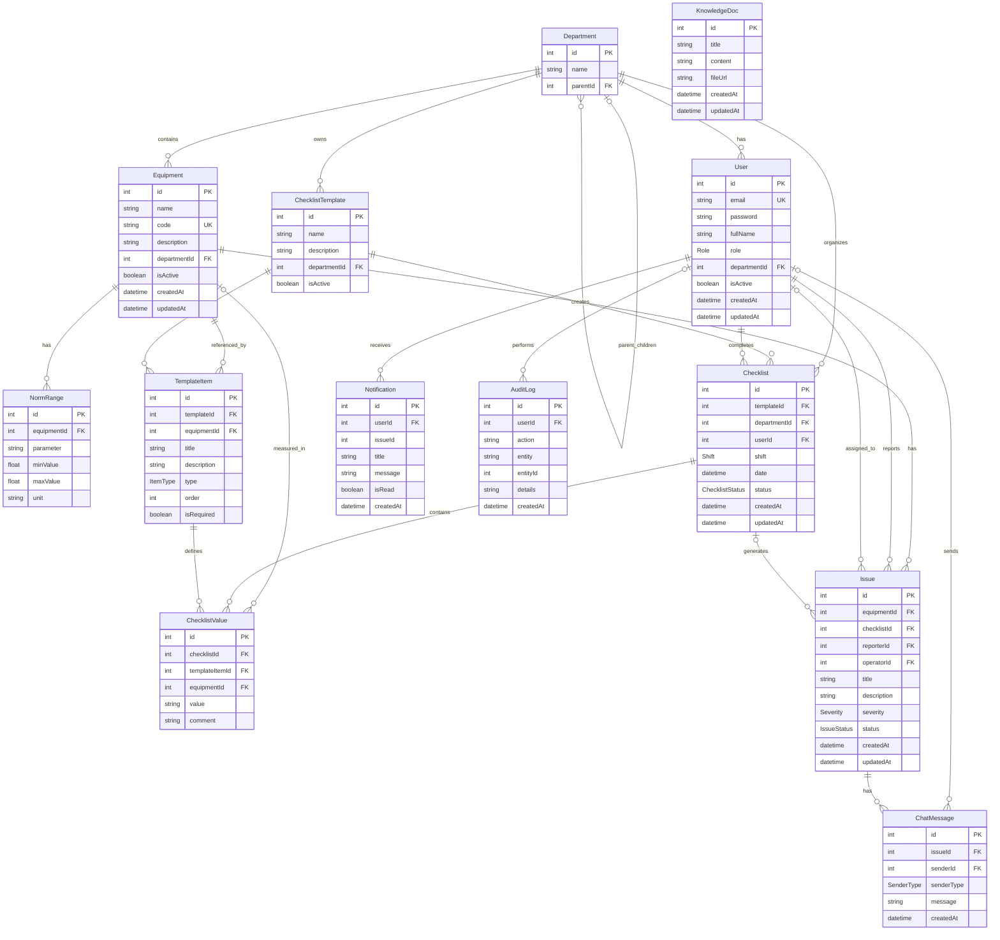

# ER-диаграмма базы данных PlantPulse

Диаграмма отражает структуру базы данных проекта PlantPulse, основные сущности, их атрибуты и взаимосвязи.

```mermaid
erDiagram
    Department {
        int id PK
        string name
        int parentId FK
    }

    User {
        int id PK
        string email UK
        string password
        string fullName
        Role role
        int departmentId FK
        boolean isActive
        datetime createdAt
        datetime updatedAt
    }

    Equipment {
        int id PK
        string name
        string code UK
        string description
        int departmentId FK
        boolean isActive
        datetime createdAt
        datetime updatedAt
    }

    NormRange {
        int id PK
        int equipmentId FK
        string parameter
        float minValue
        float maxValue
        string unit
    }

    ChecklistTemplate {
        int id PK
        string name
        string description
        int departmentId FK
        boolean isActive
    }

    TemplateItem {
        int id PK
        int templateId FK
        int equipmentId FK
        string title
        string description
        ItemType type
        int order
        boolean isRequired
    }

    Checklist {
        int id PK
        int templateId FK
        int departmentId FK
        int userId FK
        Shift shift
        datetime date
        ChecklistStatus status
        datetime createdAt
        datetime updatedAt
    }

    ChecklistValue {
        int id PK
        int checklistId FK
        int templateItemId FK
        int equipmentId FK
        string value
        string comment
    }

    Issue {
        int id PK
        int equipmentId FK
        int checklistId FK
        int reporterId FK
        int operatorId FK
        string title
        string description
        Severity severity
        IssueStatus status
        datetime createdAt
        datetime updatedAt
    }

    ChatMessage {
        int id PK
        int issueId FK
        int senderId FK
        SenderType senderType
        string message
        datetime createdAt
    }

    KnowledgeDoc {
        int id PK
        string title
        string content
        string fileUrl
        datetime createdAt
        datetime updatedAt
    }

    Notification {
        int id PK
        int userId FK
        int issueId
        string title
        string message
        boolean isRead
        datetime createdAt
    }

    AuditLog {
        int id PK
        int userId FK
        string action
        string entity
        int entityId
        string details
        datetime createdAt
    }

    Department o|--o{ Department : parent_children
    Department ||--o{ User : has
    Department ||--o{ Equipment : contains
    Department ||--o{ ChecklistTemplate : owns
    Department ||--o{ Checklist : organizes

    Equipment ||--o{ NormRange : has
    Equipment ||--o{ TemplateItem : referenced_by
    Equipment o|--o{ ChecklistValue : measured_in
    Equipment ||--o{ Issue : has

    ChecklistTemplate ||--o{ TemplateItem : contains
    ChecklistTemplate ||--o{ Checklist : creates

    User ||--o{ Checklist : completes
    User ||--o{ Issue : reports
    User o|--o{ Issue : assigned_to
    User o|--o{ ChatMessage : sends
    User ||--o{ Notification : receives
    User o|--o{ AuditLog : performs

    Checklist ||--o{ ChecklistValue : contains
    Checklist o|--o{ Issue : generates

    TemplateItem ||--o{ ChecklistValue : defines

    Issue ||--o{ ChatMessage : has
```